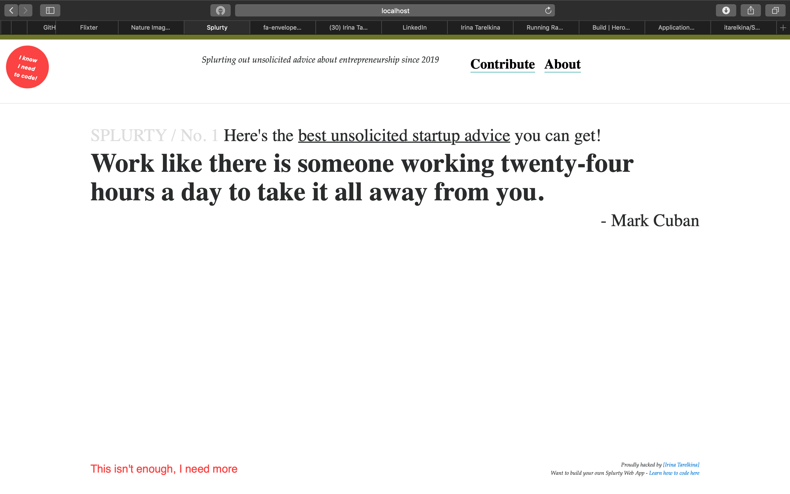

# README

This README would normally document whatever steps are necessary to get the
application up and running.

Things you may want to cover:

* Ruby version
ruby '2.5.3'

* Dependencies
gem 'simple_form'

